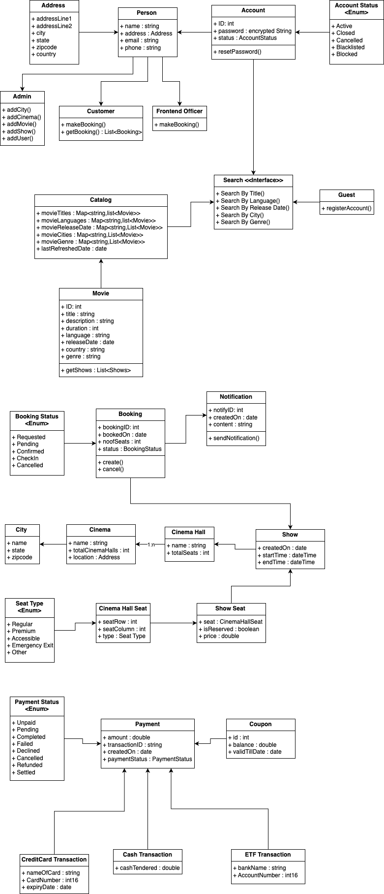
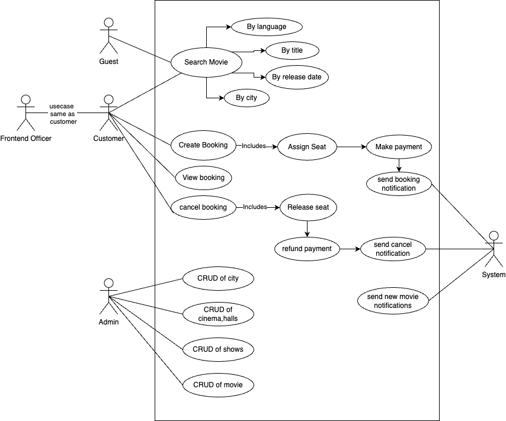
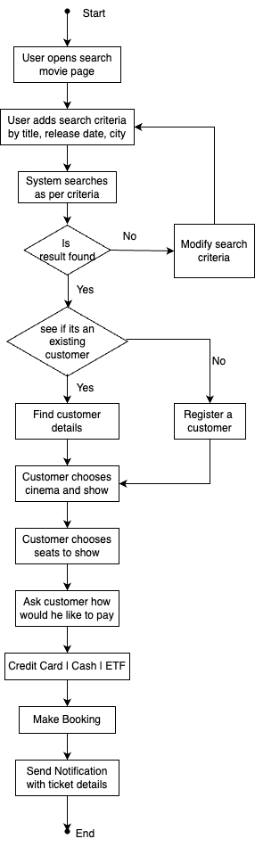

# Designing a Movie Ticket Booking System like BookMyShow

### Requirements:
1. The system should display all active theatre or active movies wrt to selected city or location as choosen by user.
2. theatre can have multiple theatre halls, each hall have a seating arrangement, and each hall can run one movie at a time.
3. Within a day, one movie can have multiple shows.
4. The system should allow theatre admins to create, update and remove theatre halls, movies, movie shows and seating arrangements of theatre halls.
5. The User should be able to search movie by language, title, release date and city name.
6. On selecting a movie, all active theatres running that movie present in city should be displayed by system.
7. User should be able to select the theatre and book the ticket.
8. System should redirect to seating arrangement where user should be able to select the seat.
9. User should be able to do payment and confirm the booking.
10. The system should handle concurrent bookings and ensure seat availability is updated (vacant and occupied) in real time.
11. The seat should show different types of seats ( normal, premium, etc) with pricing.
12. System should be scalable to handle a large no.of concureent users and bookings.
13. User should be able to cancel the bookings.

### Core Components: 
1. User : Represents people using the system
2. Theatre
3. Movie
4. Show
4. Booking
5. Payment
6. Notification

### Class Definations:
1. User:
- Attributes => userId, name, email, phone 

2. Theatre: 
- Attributes => theatreId, Address, theatre Name, total halls
- Methods    => CRUD of Theatre

3. Screen
- Attributes => screenId, screen Name, theatreId, total seats
- Methods    => CRUD of Screen

4. Seat
- Attributes => SeatId, Row No, Column No, SeatType {Regular, Premium}
- Methods    => CRUD of Seat

5. Movie
- Attributes => Id, Name, description, duration, Language, Genre, release date, List{Actors}, List{Reviews}
- Methods    => CRUD of Movie

6. Show
- Attributes => ShowId, MovieId,  scrrenId, startTime, endTime, date, map{SeatNo}SeatLock
- Methods    => AddShow(), GetSeatsStatus()

7. Seat Lock
- Attributes => status, lock
- Methods    => GetStatus(), SetStatus()

8. Booking
- Attributes => TicketId, List{seatIds}, Booking Status, userId, showId
- Methods    => CreateBooking(), CancelBooking(), ViewBooking()

9. Payment
- Attributes => TransactionId, Payment Status, Amount, Payment Mode, payment Date
- Methods    => MakePayment()

10. Notification
- Attributes => message, status, Notification Type
- Methods    => SendNotification()

11. Catalog : List{Movie}
- Methods => SearchMovie(SearchParams)

12. SearchParams
- city, genre, title, language, release date

### Entity Relationship:
1. theatre to screen => 1:n 
2. screen to seat => 1:n
3. screen to show => 1:n
4. show to show seat => 1:n
5. user to booking => 1:n
6. Booking to payment => 1:1
7. movie to show => 1:n

### Design Patterns
1. Builder Pattern for movie Class 
2. Strategy Pattern for seat locking
3. Observer pattern for user notification

