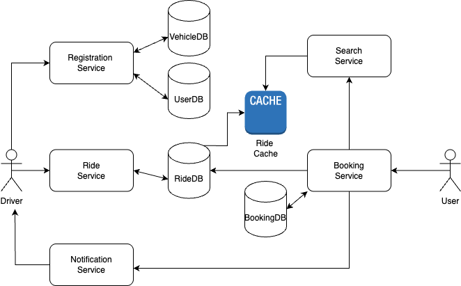

## Ride share service
Design a system which users can share a ride, allowing driver to publish a ride and other users to book for ride discussing below components.
- Registration
- Discovery/Search
- Ride matching 
- Booking and cancel

### Functional Requirements:
1. User registration
2. Vehicle Registration
3. User location should be updated every 10 s.
4. Driver should be able to publish ride details -> start, destination, timing, cur Available seats
5. User should be able to search from source to destination 
6. Ride matching according to route
7. User can request a ride and driver can accept or reject accordingly.
8. Once booked, either of them can cancel

### Core Entity Design
1. User ->{Id,name, email, phone}
2. Driver Details extends User
- Params: {UserId -> primary+ foreign key, DiverLicense}

3. Vehicle ->{DriverId, Id, vehicleNo, basic vehicle details, seats}

4. Ride -> { RideId, DriverId -> foreign key, VehicleId, Source, Destination, StartTime, EndTime, Date, Seats Available, RideStatus : WillStart, OnGoing, Completed} // here source and destination are wrt driver
5. Booking->{ BookingId, UserId, RideId, Status : New,Pending,  Booked, Cancelled, Source , Destination} // here source and destination are wrt user

### Database Choices
- MySQL for data store
- Redis for caching Rides -> hashset i.e key: source-destination, Value : hashset of rideIds
- Elastic search for faster search

### API Design
1. Search API
- POST /api/v1/search
- RequestBody: { source:xx, destination:xx, StartTime:xx, EndTime:xx }
- Response : BookingId , all the related rides

2. Publish Ride
- POST /api/v1/ride/create
- RequestBody {Ride details}
	
3. Booking Service APIs
- POST /api/v1/booking/accept?bookingId=xx
- POST /api/v1/booking/cancel?bookingId=xx
- POST /api/v1/booking/request?rideId==xx&bookingId=xx

