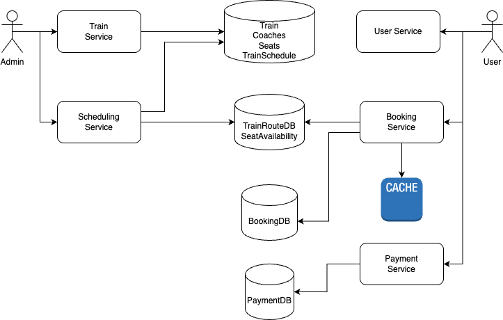

## Design an IRCTC Train seat Booking System

### Requirements:
1. Train search from source to destination
2. Get Seat Availability : coach level -> AC, Non AC
3. Book n number of seats with optional preference on seat type
- book a window seat if not available book another seats
- book lower berth available if not don't book 

### Core Entities
1. Train -> TrainId, Name, NoofCoaches, Days, StartStationId, DestinationStationId, StationsTimingMap, Distance, StartTime, EndTime

2. Station -> StationId, StationName, City, State, Pincode

3. Coach -> TrainId, CoachId, CoachType, NoofSeats

4. Seat -> TrainId, CoachId, SeatId, SeatType

5. Train Route -> RouteId, TrainId, StationId, Date, ArrivalTime, DepartureTime, Status : Late/Ontime/Arrived/Departed/Cancelled

6. SeatAvailability -> RouteId, TrainId, SeatId, BookingId, Date, StationId, Status- Booked, Available

7. Booking -> BookingId, UserId, TrainId, Date, NoofSeats, SeatIds, SeatPreference, FromStation, ToStation, Status: Confirmed/Waiting/Cancelled, PaymentStatus: Paid/Pending/Failed

8. User -> UserId, Name, Email, PhoneNo, EncrptedPassword

9. SeatManager: SeatAvailablity
- CheckSeatAvailability(seatPreference) []AvailableSeats -> Strategy Pattern for windowSeat or lower berth seat logic
- SeatBooking(seatIds)

10. BookingManager : Booking, SeatManager
- CreateBooking(seatPreference)
- ConfirmBooking()
- CancelBooking()

